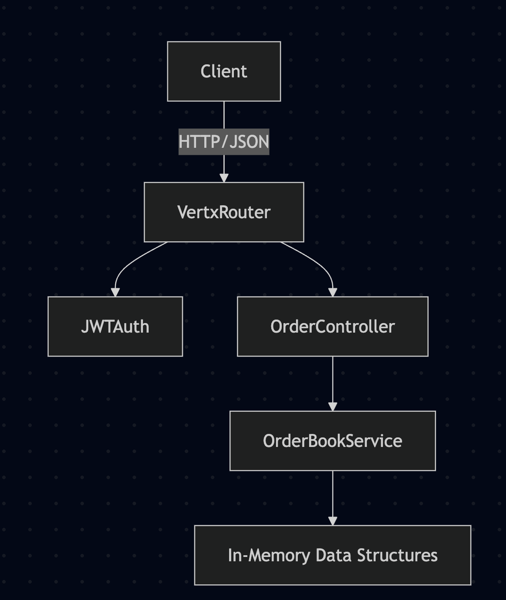

# resvera - an In-Memory Order Book (Kotlin + Vert.x)

This project implements a simplified **in-memory order book** with order matching, using **Kotlin** and **Vert.x**.
It exposes REST APIs for submitting limit orders, retrieving order books, and viewing recent trades.
JWT authentication is supported.

---

## 📂 Project Structure


```
src
└── main
    └── kotlin
        └── com
            └── resvera
                ├── model # Data models (Order, Trade, enums)
                ├── service # Order book logic
                ├── api # REST API (routes, DTOs)
                └── Application.kt # Entry point
└── test
    └── kotlin
        └── com
            └── resvera
                └── service # Unit tests for order book logic
```


---

## 🚀 Running the Application
### Local
1. Clone this repo.
2. Run with Gradle:
```bash
./gradlew run
```
The HTTP server will start on http://localhost:8080.

## ▶️ Running the App in GitHub Codespaces
1. Open Codespaces for this repository. GitHub will provision a containerized dev environment.
2. Run with gradle:

```
./gradlew run
```

3. Forward port 8080:
- In the Codespaces menu, go to Ports → Forward Port
- Add port 8080
- Choose Public if you want us to access it directly, or Private if only you will test.
Access the API using the forwarded URL:

🔑 Authentication
```
curl -X POST https://<codespaces-url>/auth/login \
  -H "Content-Type: application/json" \
  -d '{"username":"test","password":"password"}'
```

Response:
```
{"token":"<jwt-token>"}
```


Use the token in subsequent requests:
```
-H "Authorization: Bearer <jwt-token>"
```

📡 API Endpoints
1. Get Order Book

#### GET /:currencyPair/orderbook

Example:
```
curl -H "Authorization: Bearer <token>" \
http://<codespaces-url>/BTCZAR/orderbook
```
Response:
```
{
"asks": [
 {
  "id":"...",
  "side":"SELL",
  "price":500000,
  "quantity":0.2,
  "currencyPair":"BTCZAR"
  }
 ],
"bids": [
{
 "id":"...",
  "side":"BUY",
  "price":490000,
  "quantity":0.5,
  "currencyPair":"BTCZAR"
  }
 ]
}
```


2. Submit Limit Order

#### POST /v1/orders/limit

Payload:
```
{
 "side": "BUY",
 "price": 500000,
 "quantity": 0.1,
 "currencyPair": "BTCZAR"
}
```


Response (list of trades executed immediately):
```
[
  {
  "side":"BUY",
  "price":500000,
  "quantity":0.1,
  "currencyPair":"BTCZAR",
  "lastChange":1691234567890
  }
]
```

If unmatched, order is stored in the order book.

3. Recent Trades

#### GET /:currencyPair/tradehistory

Example:
```
curl -H "Authorization: Bearer <token>" \
http://<codespaces-url>/BTCZAR/tradehistory
```


Response:
```
[
 {
  "side":"SELL",
  "price":495000,
  "quantity":0.05,
  "currencyPair":"BTCZAR",
  "lastChange":1691234567890
 }
]
```

🏗️ Architecture




- Vert.x Router handles requests

- JWTAuth protects endpoints

- OrderBookService manages matching + trades

- In-Memory Store holds bids, asks, trades

